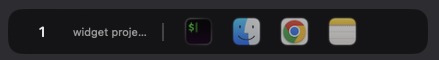
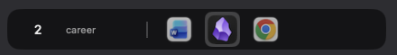

# SpaceWidget

macOS Space별 컨텍스트를 관리하기 위한 플로팅 위젯. 여러 프로젝트를 Space별로 나눠 쓰는 흐름에서, 기본 Dock이 현재 Space의 작업 맥락을 충분히 보여주지 못하는 문제를 보완하기 위해 시작한 프로젝트입니다.

현재 Space의 번호와 컨텍스트 라벨, 해당 Space에서 작업 중인 앱 목록을 하단 패널에 표시하고, 상태를 `state.json`으로 기록합니다.

## Why

mac을 쓰면서 요즘 API 기반 프로젝트를 여러 개 병렬로 다루면, 자연스럽게 Space를 프로젝트 단위 작업 컨텍스트로 쓰게 됩니다. 문제는 기본 Dock이 현재 Space 기준의 맥락을 명확히 보여주지 못한다는 점입니다.

SpaceWidget은 이 지점을 보완합니다.

- 지금 내가 어느 Space에서 작업 중인지 바로 보이게 하고
- 그 Space의 컨텍스트 라벨을 직접 붙일 수 있게 하고
- 현재 작업 중인 앱만 빠르게 훑고 다시 전환할 수 있게 합니다

## Preview

### Menu Bar Icon


### Live Screenshots





## Features

- **Space-Aware Context Bar** — 현재 활성 Space 번호와 컨텍스트 라벨을 좌하단 플로팅 바에 표시
- **Running App Snapshot** — 현재 화면의 실행 앱을 수집해 아이콘 목록으로 렌더링
- **Single Snapshot Pipeline** — `SpaceEngine`이 단일 `DockSnapshot`을 발행하고 UI/상태 기록이 이를 구독
- **Swipe Pagination** — 앱 수가 많을 때 좌우 스와이프로 페이지 전환
- **Inline Label Editing** — 컨텍스트 라벨 영역 클릭으로 Space 라벨 편집
- **State Export** — `~/.config/space-dock/state.json`과 `spacewidget.log` 기록
- **Menu Bar Controls** — 메뉴바 아이콘에서 `Quit SpaceWidget` 종료
- **Config-Driven Defaults** — `ignored_apps.json`, `space_labels.json`, `app_actions.json` 기반 동작

## Product Boundary

현재 구현 기준으로 SpaceWidget은 아래를 제공합니다.

- 활성 macOS Space 감지
- 현재 Space 기준 실행 앱 목록 수집
- 단일 snapshot 파이프라인
- `state.json` 상태 export
- 하단 좌측 플로팅 Space bar
- 앱 아이콘 페이지네이션
- 아이콘 클릭 앱 활성화
- 메뉴바 아이콘 및 종료 메뉴

현재 구현에 포함되지 않는 것:

- config file watching
- signal-driven reload
- accessibility permission flow
- 별도 action/controller 계층
- 전용 UI view model 레이어

## Architecture

```text
space-widget/
├── Sources/SpaceWidget/
│   ├── App/
│   │   ├── SpaceWidgetApp.swift       ← 앱 진입점, 의존성 조립
│   │   └── MenuBarController.swift    ← 메뉴바 아이콘 + 종료 메뉴
│   ├── Config/
│   │   ├── ConfigManager.swift        ← 설정 로드/저장
│   │   ├── Logger.swift               ← 파일 + stderr 로그
│   │   ├── Migrator.swift             ← 설정 마이그레이션
│   │   └── StateWriter.swift          ← state.json 기록
│   ├── Engine/
│   │   ├── SpaceMonitor.swift         ← 현재 Space 감지
│   │   ├── WindowListProvider.swift   ← 앱 목록 수집
│   │   ├── SpaceEngine.swift          ← 단일 snapshot 파이프라인
│   │   └── CGSPrivate.swift           ← macOS private API bridge
│   ├── Panel/
│   │   ├── SpacePanel.swift           ← 투명 NSPanel
│   │   └── SpacePanelController.swift ← 패널 생성/업데이트
│   ├── Views/
│   │   └── SpaceBarView.swift         ← SwiftUI 바 UI
│   ├── Models/
│   │   ├── ActiveSpace.swift
│   │   ├── DockItem.swift
│   │   └── DockSnapshot.swift
│   └── Resources/
│       └── icon.png                   ← 메뉴바 아이콘
├── RunSpaceWidget.app                 ← 터미널 없이 실행되는 Finder 런처
├── RunSpaceWidget.command             ← 로컬 실행 런처
├── Makefile
└── README.md
```

### Data Flow

```text
ConfigManager
    ├─ ignored apps
    └─ space labels

SpaceMonitor + WindowListProvider
    └─ feed SpaceEngine

SpaceEngine
    ├─ publishes DockSnapshot
    ├─ reacts to active space changes
    └─ reacts to app activate / launch / terminate

Subscribers
    ├─ StateWriter          → state.json
    └─ SpacePanelController → SpaceBarView
```

### Runtime Responsibilities

| Component | 역할 |
|------|------|
| `ConfigManager` | 설정 디렉터리 관리, 기본 파일 생성, 라벨/무시 앱 로드 및 저장 |
| `SpaceMonitor` | 현재 desktop Space 감지, transient/unmanaged space 필터링 |
| `WindowListProvider` | 화면상 앱 목록 수집, bundle 단위 dedupe, 아이콘 해석 |
| `SpaceEngine` | 단일 `DockSnapshot` 소유, refresh scheduling, stale snapshot drop |
| `StateWriter` | `state.json` debounce 기록 |
| `SpacePanelController` | 전체 화면 패널 생성, snapshot 기반 UI 갱신 |
| `SpaceBarView` | Space 라벨/앱 아이콘 렌더링, 스와이프, 앱 활성화 |
| `MenuBarController` | 메뉴바 아이콘 및 종료 메뉴 |

## Quick Start

```bash
# 저장소 이동
cd /Users/chabh/workspace/space-widget

# 디버그 빌드
swift build

# 바로 실행
./.build/debug/SpaceWidget

# 터미널 런처 사용
./RunSpaceWidget.command

# Finder에서 더블클릭 실행
open RunSpaceWidget.app
```

`RunSpaceWidget.app`은 터미널 창 없이 실행되는 Finder용 런처입니다.  
`RunSpaceWidget.command`는 터미널 기반 런처입니다.

## Install

```bash
# 릴리즈 빌드
make build

# /usr/local/bin/SpaceWidget 설치
make install

# 설치 후 실행
/usr/local/bin/SpaceWidget

# 설치 후 Finder 런처 사용
open RunSpaceWidget.app
```

## Workflow

```text
1. Space 전환 감지        → SpaceMonitor
2. 앱 목록 수집          → WindowListProvider
3. snapshot 발행         → SpaceEngine
4. 패널 갱신             → SpacePanelController / SpaceBarView
5. 상태 파일 기록        → StateWriter
6. 컨텍스트 수정         → 라벨 클릭 → ConfigManager 저장
7. 종료                  → 메뉴바 아이콘 → Quit SpaceWidget
```

### 생성/갱신되는 상태 파일

```text
~/.config/space-dock/
├── ignored_apps.json
├── space_labels.json
├── app_actions.json
├── state.json
└── spacewidget.log
```

## Configuration

기본 설정 디렉터리:

```bash
~/.config/space-dock
```

기본 상수:

- fallback space label: `"Untitled"`
- 기본 space label: `"1" -> "Work"`, `"2" -> "Browse"`
- 최대 렌더링 앱 수: `20`
- 페이지당 아이콘 수: `5`

지원 옵션:

```bash
SpaceWidget --help
SpaceWidget --version
SpaceWidget --migrate
SpaceWidget --migrate --force
SpaceWidget --config-dir /custom/path
```

## Development

```bash
# 디버그 빌드
swift build

# Finder용 무터미널 런처 실행
open RunSpaceWidget.app

# 릴리즈 빌드
make build

# 설치/삭제
make install
make uninstall

# 설정 마이그레이션
make migrate

# 클린
make clean

# 전환 테스트 스크립트
bash scripts/test-transition.sh
```

## Verification

기본 검증 순서:

1. `swift build`
2. 앱 실행
3. `spacewidget.log`에 `[SPACE]`, `[FETCH]`, `[SNAPSHOT]` 출력 확인
4. `state.json` 갱신 확인
5. 하단 패널 갱신 및 아이콘 클릭 활성화 확인
6. 메뉴바 아이콘 종료 메뉴 확인

## UI

- 바는 전체 화면 투명 `NSPanel` 위에 좌하단 정렬로 표시됩니다.
- 라벨 영역 클릭 시 현재 Space 컨텍스트를 편집할 수 있습니다.
- 앱 아이콘 클릭 시 해당 앱을 활성화합니다.
- 메뉴바 아이콘 클릭 시 종료 메뉴를 사용할 수 있습니다.
- `RunSpaceWidget.app` 더블클릭으로 터미널 없이 실행할 수 있습니다.

## Notes

- macOS 전용 프로젝트입니다.
- SwiftPM 기반으로 빌드합니다.
- CGS private API를 사용하므로 macOS 내부 동작 변화에 영향을 받을 수 있습니다.
- 리팩토링은 현재 제품 경계를 유지하는 방향으로 진행해야 합니다.
